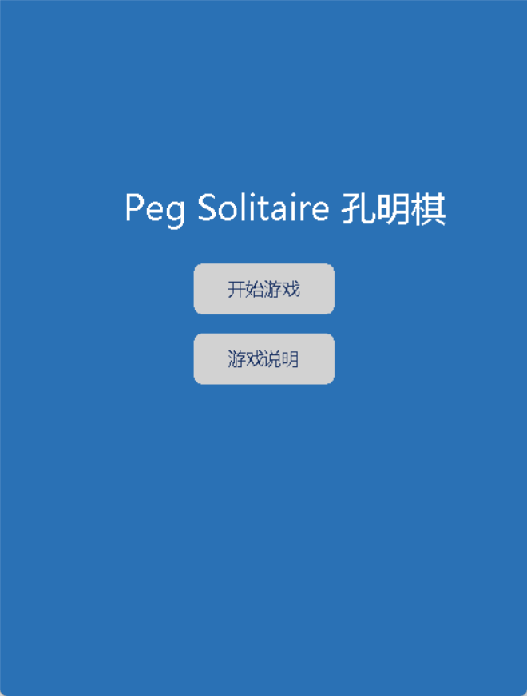
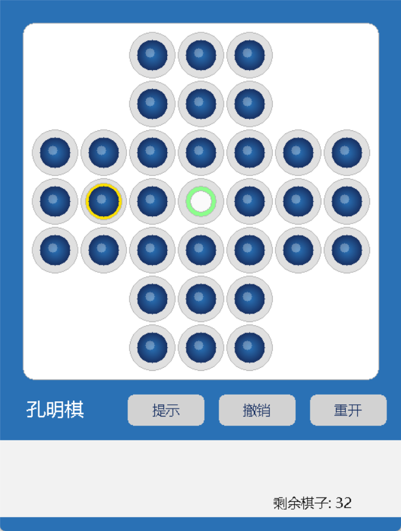
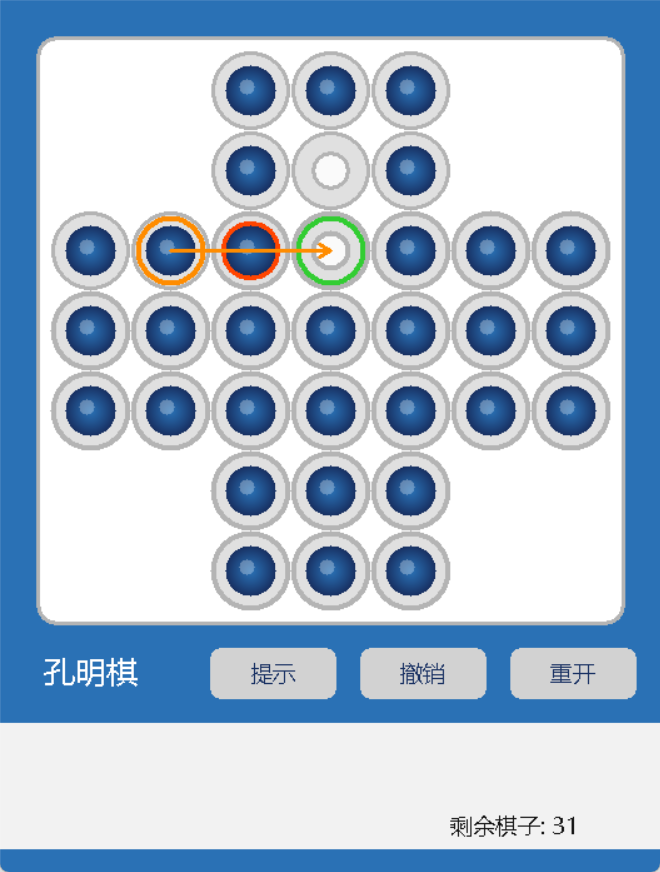

# Peg Solitaire Solver & Visual Game (孔明棋图形化求解器)

A modern and interactive **English Peg Solitaire** game with a C++-based graphical UI, AI hint engine, and optimal solver — all built with [EasyX](https://docs.easyx.cn/) and multithreading techniques.

📌 **课程**：高级语言程序设计（基础）  
👨‍🎓 **作者**：余政希（2452633）｜人工智能（精英班），国豪书院  
📅 **时间**：2025年5月

## 🌟 项目特色 Highlights

- 🎨 **美观界面**：使用 EasyX 实现了蓝色渐变棋子与镜面高光。
- 🧠 **AI 智能提示**：集成启发式搜索与最优跳法求解器。
- ♻️ **撤销与重做**：完整实现游戏控制逻辑，支持用户操作追溯。
- ⌛ **多线程求解**：求解器与 UI 分离，支持 ESC 中断与实时反馈。
- 📊 **高效搜索算法**：
  - 位板状态编码
  - D₄ 对称约化压缩状态空间
  - 多项一致启发式（角孔 / Peg-Type / Merson 区域）
  - 三路 Pattern Database（PDB）压缩查表
  - BF-IDA\* 搜索引擎实现最小 moves 解

## 🖼️ 项目截图

| 主界面 | 游戏界面 | 求解提示 |
|--------|----------|----------|
|  |  |  |

## ⚙️ 编译与运行

项目使用 Visual Studio + EasyX 图形库，仅支持 Windows 平台。
1.	安装 EasyX：从 官网 下载并配置。
2.	使用 Visual Studio 打开 project.sln。
3.	构建并运行即可。

## 📚 参考资料
- Barker, J., & Korf, R. E. (2012). Solving Peg Solitaire with Bidirectional BFIDA*. AAAI-12.
- Bell, G. (2020). Analysis of Peg Solitaire. pegsolitaire.org
- EasyX 图形库官方文档：https://docs.easyx.cn/

## 贡献指南

欢迎提交 Issue 和 Pull Request。

## 许可证

MIT License